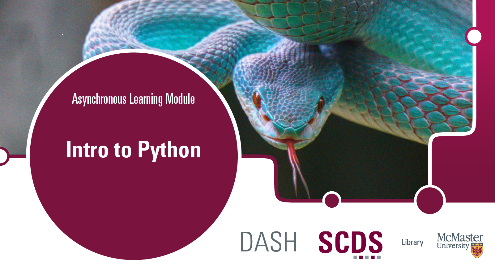

<!-- 
This will be the home page of your module. It should give a small introduction to the student about the workshop topic.
Add, edit, or remove any content below for the workshop in question. -->

<!-- Title slide image. Replace img src with your own, or comment this out. -->

<!-- Main header -->
# Introduction to Python

This beginner level workshop will introduce you to the basic concepts of one of the world's most popular programming languages, Python. In this tutorial, you'll learn (learning objectives line). No prior knowledge of Python is required.

Presentation by Vivek Jadon, Data Specialist. [Get in touch with Vivek.](https://library.mcmaster.ca/index.php/jadon-vivek)

## Prerequisites

<!-- If creating or installing is covered in the module (preparation), mention that in brackets. -->
Access to one of the following (this will be covered in the Preparation page):
- Jupyter Notebook
- Google Colab
- Local Python installation (Anaconda)

## Learning Objectives

<!-- What will the student learn to do, learn to use, etc. -->
By the end of this tutorial, you should be able to:
- Describe what Python is and how it can be used
- Create, use, and modify variables to store and use data
- Display textual data to the screen
- Understand the different Python built-in data types
- Use conditional statements and loops
- Create and use functions

<!-- Estimate the time the workshop will take to complete. Feel free to remove this. -->
## Duration (optional)
This module will take around 2 to 3 hours, however feel free to work at your own pace!

## Land Acknowledgement
We'd like to acknowledge that McMaster University sits on the Territories of the Mississauga and Haudenosaunee Nations, and within the lands protected by the Dish With One Spoon wampum agreement.
