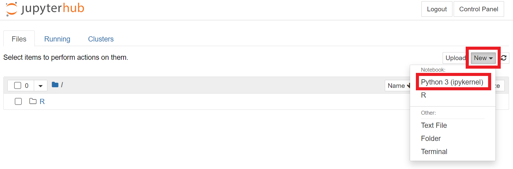
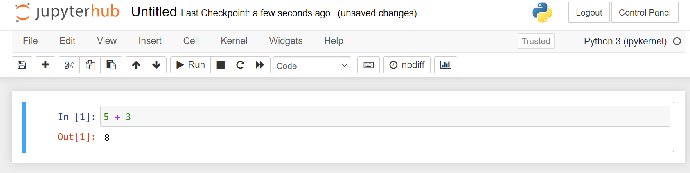
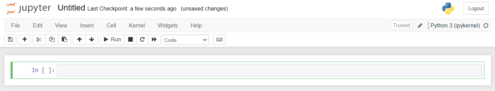

<!-- 
This page is an example lesson template.
Add, edit, or remove any content below for the workshop in question. -->

<!-- Putting a {: .no_toc} above a header removes it from the table of contents -->

{: .no_toc}  
# Lesson 0 - Using your IDE

This lesson will go over the basic functionality of the IDEs highlighted in the Preparation page.

<!-- This is your table of contents. You don't need to touch it, it automatically creates it when you add or remove headers. If you do not want a header to be included, put {: .no_toc } above the header line, as you can see above with Lesson 1 - Lesson Name. Make sure that there's also an empty line above {: .no_toc }... Markdown is picky about this :( -->

  

    Table of Contents
  

  {: .text-delta }
- TOC
{:toc}

<!-- Here are your learning objectives. Just like in the introduction, but more specific for this lesson. -->
## Lesson Objectives
- Learn how to create, edit, and run Python files.

<!-- A video for your lesson (if applicable) -->
<!-- ## Lesson Video
The following video demonstrates each of the steps outlined below in text.

<iframe height="416" width="100%" allowfullscreen frameborder=0 src="https://echo360.ca/media/a65689c0-c35c-4f33-9c12-f0ac97883f54/public?autoplay=false&automute=false"></iframe>
[View original here.](https://echo360.ca/media/a65689c0-c35c-4f33-9c12-f0ac97883f54/public?autoplay=false&automute=false) -->

<!-- Text content format for your lessons if you don't want to rely on videos, or want to provide another format of learning consumption. -->

## Choose your IDE

Follow the instructions outlined in one of the dropdown menus below.

 Jupyter Notebook - Recommended 

If you haven't already, [sign in to Jupyter Notebook](https://mcmaster.syzygy.ca/).

The home page of Jupyter Notebook is the file explorer, where you can access any files you created. If it's your first time using Jupyter Notebook, it'll be empty. To create a new Python Notebook file (.ipynb), click on the `New` button at the top right and select `Python3 (ipykernel)`.

 

You should automatically be sent to your Python Notebook environment. It should look like the screenshot below.
- If you ever want to go back to the home page, click on the JupyterHub logo at the top left.
- You can rename your Python Notebook file by clicking on the "Untitled" text beside the JupyterHub logo.
- To save your file, use the `Save and Checkpoint` button with a disk icon found below the JupyterHub logo. You can also use `Ctrl` + `S` shortcut (or `Cmd` + `S` for Mac users) to save.

 

Your Python Notebook file consists of code blocks. You can write Python code in these blocks and run them using the `Run` button. If there's any output, it will be shown directly below that code block.

{: .warning}
If a code block is taking too long to run, you might have encountered an infinite loop. Use the `interrupt the kernel` button beside the `Run` button to stop it.

 

To create new code blocks, click on the `+` button beside the `Save and Checkpoint` button.

{: .note }
No matter what code block you're on, Python Notebook will keep the data of all previously run code blocks. If you're opening up a Notebook, or your Notebook connection resets, you have to run every block code from the start.

 Google Colab - Online Alternative

If you haven't already, [sign in to Google Colab](https://colab.research.google.com/).

After signing in, you may encounter the `Recent` page below. This is where you'll be able to open up recent Python Notebook files (.ipynb). To create a new Python Notebook file, we'll need to `Cancel` out of this pop-up.

 

Navigate to the top left of your screen, click on `File`, and then click on `New notebook`.

 

You should automatically be sent to your Python Notebook environment. It should look like the screenshot below.
- To view all of your Colab files, click on the Colab logo at the top left. 
- You can rename your Python Notebook file by clicking on the "Untitled.ipynb" text beside the Colab logo.
- Google Colab automatically saves your work, no need for manual saving.

 

Your Python Notebook file consists of code blocks. You can write Python code in these blocks and run them using the `Run` button. If there's any output, it will be shown directly below that code block.

{: .warning}
If a code block is taking too long to run, you might have encountered an infinite loop. Use the `interrupt the kernel` button beside the `Run` button to stop it.

 

To create new code blocks, click on the `+` button beside the `Save and Checkpoint` button.

{: .note }
No matter what code block you're on, Python Notebook will keep the data of all previously run code blocks. If you're opening up a Notebook, or your Notebook connection resets, you have to run every block code from the start.

 Anaconda - Local Version of Jupyter Notebooks 

If you haven't already downloaded and installed Anaconda:
- Download and install at <https://www.anaconda.com/>.
- Follow along with the guide for your OS system for installation instructions.
  - Windows: <https://docs.anaconda.com/free/anaconda/install/windows/>
  - MacOS: <https://docs.anaconda.com/free/anaconda/install/mac-os/>
  - Linux: <https://docs.anaconda.com/free/anaconda/install/linux/>

Once that's installed, open up the **Anaconda Navigator** application. Included in the Anaconda package are four great tools/IDEs to create Python files with. JupyterLab, Jupyter Notebooks, Spyder, and Visual Studio Code. 

Spyder and Visual Studio Code are standalone IDEs, whereas JupyterLab and Jupyter Notebooks opens up locally in your browser. For the purposes of this workshop, we recommend you use Jupyter Notebooks.

 

When you first launch Jupyter Notebooks, you will see a file explorer. Go to the location you want to store your Python files in, (I recommend making a new "Python" folder in the Documents directory).

 

To create a new Python Notebook file (.ipynb), click on the `New` button at the top right and select `Python3 (ipykernel)`.

 

You should automatically be sent to your Python Notebook environment. It should look like the screenshot below.
- If you ever want to go back to the home page, click on the JupyterHub logo at the top left.
- You can rename your Python Notebook file by clicking on the "Untitled" text beside the JupyterHub logo.
- To save your file, use the `Save and Checkpoint` button with a disk icon found below the JupyterHub logo. You can also use `Ctrl` + `S` shortcut (or `Cmd` + `S` for Mac users) to save.

 

Your Python Notebook file consists of code blocks. You can write Python code in these blocks and run them using the `Run` button. If there's any output, it will be shown directly below that code block.

{: .warning}
If a code block is taking too long to run, you might have encountered an infinite loop. Use the `interrupt the kernel` button beside the `Run` button to stop it.

 

To create new code blocks, click on the `+` button beside the `Save and Checkpoint` button.

{: .note }
No matter what code block you're on, Python Notebook will keep the data of all previously run code blocks. If you're opening up a Notebook, or your Notebook connection resets, you have to run every block code from the start.

<!-- Summarize your learning objectives here. It acts as a reminder to the learner about what they just learned, as well as a checklist for you to make sure you covered everything you wished to cover. -->
## Key Points / Summary
- There are many ways to create, edit, and run Python files.

